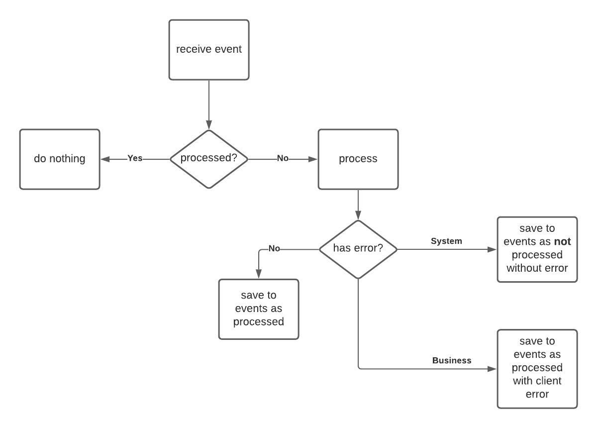

# Cyclone lariat

This is gem work like middleware for [shoryuken](https://github.com/ruby-shoryuken/shoryuken). It save all events to database. And catch and produce all exceptions.  


```ruby
# Gemfile

# If use client or middleware 
gem 'cyclone_lariat', require: false

# If use client
gem 'cyclone_lariat'
```

## Logic



## Command vs Event
Commands and events are both simple domain structures that contain solely data for reading. That means they contain no 
behaviour or business logic.

A command is an object that is sent to the domain for a state change which is handled by a command handler. They should 
be named with a verb in an imperative mood plus the aggregate name which it operates on. Such request can be rejected 
due to the data the command holds being invalid/inconsistent. There should be exactly 1 handler for each command. 
Once the command has been executed, the consumer can then carry out whatever the task is depending on the output of the 
command.

An event is a statement of fact about what change has been made to the domain state. They are named with the aggregate 
name where the change took place plus the verb past-participle. An event happens off the back of a command. 
A command can emit any number of events. The sender of the event does not care who receives it or whether it has been 
received at all.

## SnsClient
You can use client directly

```ruby
require 'cyclone_lariat/sns_client' # If require: false in Gemfile 

client = CycloneLariat::SnsClient.new(
  key: APP_CONF.aws.key,
  secret_key: APP_CONF.aws.secret_key,
  region: APP_CONF.aws.region,
  version: 1, # at default 1
  publisher: 'pilot',
  instance: INSTANCE # at default :prod
)
```

You can don't define topic, and it's name will be defined automatically 
```ruby
                     # event_type        data                                    topic
client.publish_event   'email_is_created', data: { mail: 'john.doe@example.com' } # prod-event-fanout-pilot-email_is_created
client.publish_event   'email_is_removed', data: { mail: 'john.doe@example.com' } # prod-event-fanout-pilot-email_is_removed
client.publish_command 'delete_user',      data: { mail: 'john.doe@example.com' } # prod-command-fanout-pilot-delete_user
```
Or you can define it by handle. For example, if you want to send different events to same channel.
```ruby
                     # event_type        data                                    topic
client.publish_event   'email_is_created', data: { mail: 'john.doe@example.com' }, topic: 'prod-event-fanout-pilot-emails'
client.publish_event   'email_is_removed', data: { mail: 'john.doe@example.com' }, topic: 'prod-event-fanout-pilot-emails'
client.publish_command 'delete_user',      data: { mail: 'john.doe@example.com' }, topic: 'prod-command-fanout-pilot-emails'
```

Or you can use client as Repo.

```ruby
require 'cyclone_lariat/sns_client' # If require: false in Gemfile

class YourClient < CycloneLariat::SnsClient
  version 1
  publisher 'pilot'
  instance 'stage'

  def email_is_created(mail)
    publish event('email_is_created',
                  data: { mail: mail }
            ),
            to: APP_CONF.aws.fanout.emails
  end

  def email_is_removed(mail)
    publish event('email_is_removed',
                  data: { mail: mail }
            ),
            to: APP_CONF.aws.fanout.email
  end


  def delete_user(mail)
    publish command('delete_user',
                  data: { mail: mail }
            ),
            to: APP_CONF.aws.fanout.email
  end
end

# Init repo
client = YourClient.new(key: APP_CONF.aws.key, secret_key: APP_CONF.aws.secret_key, region: APP_CONF.aws.region)

# And send topics
client.email_is_created 'john.doe@example.com'
client.email_is_removed 'john.doe@example.com'
client.delete_user      'john.doe@example.com'
```


# SqsClient
SqsClient is really similar to SnsClient. It can be initialized in same way:

```ruby
require 'cyclone_lariat/sns_client' # If require: false in Gemfile 

client = CycloneLariat::SqsClient.new(
  key: APP_CONF.aws.key,
  secret_key: APP_CONF.aws.secret_key,
  region: APP_CONF.aws.region,
  version: 1, # at default 1
  publisher: 'pilot',
  instance: INSTANCE # at default :prod
)
```

As you see all params identity. And you can easily change your sqs-queue to sns-topic when you start work with more
subscribes. But you should define destination.

```ruby
client.publish_event 'email_is_created', data: { mail: 'john.doe@example.com' }, dest: 'notify_service'
```

Or you can define topic directly:
```ruby
client.publish_event 'email_is_created', data: { mail: 'john.doe@example.com' }, topic: 'prod-event-fanout-pilot-emails'
```


# Middleware
If you use middleware:
- Store all events to dataset
- Notify every input sqs message
- Notify every error 

```ruby
require 'cyclone_lariat/middleware' # If require: false in Gemfile

class Receiver
  include Shoryuken::Worker
  
  DB = Sequel.connect(host: 'localhost', user: 'ruby')

  shoryuken_options auto_delete: true,
                    body_parser: ->(sqs_msg) {
                      JSON.parse(sqs_msg.body, symbolize_names: true)
                    },
                    queue: 'your_sqs_queue_name'

  server_middleware do |chain|
    
    # Options dataset, errors_notifier and message_notifier is optionals.
    # If you dont define notifiers - middleware does not notify
    # If you dont define dataset - middleware does store events in db
    chain.add CycloneLariat::Middleware,
              dataset: DB[:events],
              errors_notifier: LunaPark::Notifiers::Sentry.new,
              message_notifier: LunaPark::Notifiers::Log.new(min_lvl: :debug, format: :pretty_json)
  end

  def perform(sqs_message, sqs_message_body)
    # Your logic here
  end
end
```

## Migrations
Before use events storage add and apply this two migrations

```ruby

# First one

Sequel.migration do
  up do
    run <<-SQL
      CREATE EXTENSION IF NOT EXISTS "uuid-ossp";
    SQL
  end

  down do
    run <<-SQL
      DROP EXTENSION IF EXISTS "uuid-ossp";
    SQL
  end
end

# The second one:
Sequel.migration do
  change do
    create_table :async_messages do
      column   :uuid, :uuid, primary_key: true
      String   :type,                         null: false
      Integer  :version,                      null: false
      String   :publisher,                    null: false
      column   :data, :json,                  null: false
      String   :client_error_message,         null: true,  default: nil
      column   :client_error_details, :json,  null: true,  default: nil
      DateTime :sent_at,                      null: true,  default: nil
      DateTime :received_at,                  null: false, default: Sequel::CURRENT_TIMESTAMP
      DateTime :processed_at,                 null: true,  default: nil
    end
  end
end
```

### Rake tasks

For simplify write some Rake tasks you can use CycloneLariat::Repo.

```ruby
# For retry all unprocessed

CycloneLariat.new(DB[:events]).each_unprocessed do |event|
  # Your logic here
end

# For retry all events with client errors

CycloneLariat.new(DB[:events]).each_with_client_errors do |event|
  # Your logic here
end
```
