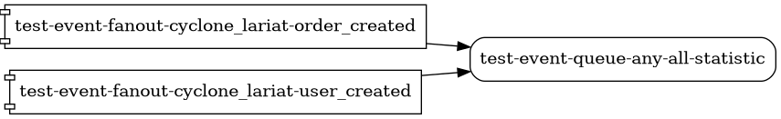

# Cyclone lariat

This gem work in few scenarios:
- As middleware for [shoryuken](https://github.com/ruby-shoryuken/shoryuken).
  - It saves all events to the database and also catches and throws all exceptions.
  - As a middleware, it can log all incoming messages.
- As a client that can send messages to SNS topics and SQS queues.
- Also it can help you with CI\CD for theme, queue and subscription management like database migration.


## Install and configuration Cyclone Lariat
### Install
<details>
  <summary>Sequel</summary>

  ### Install with Sequel
  Edit Gemfile:
  ```ruby
  # Gemfile
  gem 'sequel'
  gem 'cyclone_lariat'
  ```
  And run in console:
  ```bash
  $ bundle install
  $ cyclone_lariat install
  ```
</details>
<details>
  <summary>ActiveRecord</summary>

  ### Install with ActiveRecord
  Edit Gemfile:
  ```ruby
  # Gemfile
  gem 'active_record'
  gem 'cyclone_lariat'
  ```
  And run in console:
  ```bash
  $ bundle install
  $ cyclone_lariat install --adapter=active_record
  ```
</details>

Last install command will create 2 files:
- ./lib/tasks/cyclone_lariat.rake - Rake tasks, for management migrations
- ./config/initializers/cyclone_lariat.rb - Configuration default values for cyclone lariat usage


### Configuration
<details>
  <summary>Sequel</summary>

  ```ruby
  # frozen_string_literal: true

  CycloneLariat.configure do |c|
    c.version = 1                               # api version

    c.aws_key = ENV['AWS_KEY']                  # aws key
    c.aws_secret_key = ENV['AWS_SECRET_KEY']    # aws secret
    c.aws_account_id = ENV['AWS_ACCOUNT_ID']    # aws account id
    c.aws_region = ENV['AWS_REGION']            # aws region

    c.publisher = ENV['APP_NAME']               # name of your publishers, usually name of your application
    c.instance = ENV['INSTANCE']                # stage, production, test
    c.driver = :sequel                          # driver Sequel
    c.messages_dataset = DB[:messages]          # Sequel dataset for store income messages (on receiver)
    c.versions_dataset = DB[:lariat_versions]   # Sequel dataset for versions of publisher migrations
    c.fake_publish = ENV['INSTANCE'] == 'test'  # when true, prevents messages from being published
  end
  ```
</details>
<details>
  <summary>ActiveRecord</summary>

  ```ruby
  # frozen_string_literal: true

  CycloneLariat.configure do |c|
    c.version = 1                               # api version

    c.aws_key = ENV['AWS_KEY']                  # aws key
    c.aws_secret_key = ENV['AWS_SECRET_KEY']    # aws secret
    c.aws_account_id = ENV['AWS_ACCOUNT_ID']    # aws account id
    c.aws_region = ENV['AWS_REGION']            # aws region

    c.publisher = ENV['APP_NAME']               # name of your publishers, usually name of your application
    c.instance = ENV['INSTANCE']                # stage, production, test
    c.driver = :active_record                   # driver ActiveRecord
    c.messages_dataset = CycloneLariatMessage   # ActiveRecord model for store income messages (on receiver)
    c.versions_dataset = CycloneLariatVersion   # ActiveRecord model for versions of publisher migrations
    c.fake_publish = ENV['INSTANCE'] == 'test'  # when true, prevents messages from being published
  end
  ```
</details>

If you are only using your application as a publisher, you may not need to set the `messages_dataset` parameter.

## Client / Publisher
At first lets understand what the difference between SQS and SNS:
- Amazon Simple Queue Service (SQS) lets you send, store, and receive messages between software components at any
volume, without losing messages or requiring other services to be available.
- Amazon Simple Notification Service (SNS) sends notifications two ways Application2Person (like send sms).
And the second way is Application2Application, that's way more important for us. In this way you case use
SNS service like fanout.


For use **cyclone_lariat** as _Publisher_ lets make install CycloneLariat.

Before creating the first migration, let's explain what `CycloneLariat::Messages` is.

### Messages
Message in Amazon SQS\SNS service it's a
[object](https://docs.aws.amazon.com/AWSSimpleQueueService/latest/SQSDeveloperGuide/sqs-message-metadata.html#sqs-message-attributes)
that has several attributes. The main attributes are the **body**, which consists of the published
data. The body is a `String`, but we can use it as a _JSON_ object. **Cyclone_lariat** use by default scheme - version 1:

```json
// Scheme: version 1
{
  "uuid": "f2ce3813-0905-4d81-a60e-f289f2431f50",       // Uniq message identificator
  "publisher": "sample_app",                            // Publisher application name
  "request_id": "51285005-8a06-4181-b5fd-bf29f3b1a45a", // Optional: X-Request-Id
  "type": "event_note_created",                         // Type of Event or Command
  "version": 1,                                         // Version of data structure
  "data": {
    "id": 12,
    "text": "Sample of published data",
    "attributes": ["one", "two", "three"]
  },
  "sent_at": "2022-11-09T11:42:18.203+01:00"            // Time when message was sended in ISO8601 Standard
}
```

Idea about X-Request-Id you can see at
[StackOverflow](https://stackoverflow.com/questions/25433258/what-is-the-x-request-id-http-header).

As you see, type has prefix `event_` in cyclone lariat you has two kinds of messages - `Messages::V1::Event` and
`Messages::V1::Command`.

If you want log all your messages you can use extended scheme - version 2:
```json
// Scheme: version 2
{
  "uuid": "f2ce3813-0905-4d81-a60e-f289f2431f50",       // Uniq message identificator
  "publisher": "sample_app",                            // Publisher application name
  "request_id": "51285005-8a06-4181-b5fd-bf29f3b1a45a", // Optional: X-Request-Id
  "type": "event_note_created",                         // Type of Event or Command
  "version": 2,                                         // Version of data structure
  "object": {
    "type": "user",                                     // Object type
    "uuid": "a27c29e2-bbd3-490a-8f1b-caa4f8d902ef"      // Object uuid
  },
  "subject": {
    "type": "note",                                     // Subject type
    "uuid": "f46e74db-3335-4c5e-b476-c2a87660a942"      // Subject uuid
  },
  "data": {
    "id": 12,
    "text": "Sample of published data",
    "attributes": ["one", "two", "three"]
  },
  "sent_at": "2022-11-09T11:42:18.203+01:00"            // Time when message was sended in ISO8601 Standard
}
```
#### Subject vs Object

The difference between scheme first and second version - is subject and object. This values need to help with actions log.
For example, user #42, write to support, "why he could not sign in". The messages log is:

| Subject  | Action      | Object    |
|:---------|:------------|:----------|
| user #42 | sign_up     | user #42  |
| user #42 | sign_in     | user #42  |
| user #42 | create_note | note #769 |
| user #1  | ban         | user #42  |

It is important to understand that user #42 can be both a subject and an object. And you should save both of these fields to keep track of the entire history of this user.

#### Command vs Event
Commands and events are both simple domain structures that contain solely data for reading. That means
they contain no behaviour or business logic.

A command is an object that is sent to the domain for a state change which is handled by a command
handler. They should be named with a verb in an imperative mood plus the aggregate name which it
operates on. Such request can be rejected due to the data the command holds being invalid/inconsistent.
There should be exactly 1 handler for each command. Once the command has been executed, the consumer
can then carry out whatever the task is depending on the output of the command.

An event is a statement of fact about what change has been made to the domain state. They are named
with the aggregate name where the change took place plus the verb past-participle. An event happens off
the back of a command.
A command can emit any number of events. The sender of the event does not care who receives it or
whether it has been received at all.

### Publish
For publishing _Messages::V1::Event_ or _Messages::V1::Commands_, you have two ways, send _Message_ directly:

```ruby
CycloneLariat.configure do |config|
  # Options app here
end

client = CycloneLariat::Clients::Sns.new(instance: 'auth', version: 1)

client.publish_command('register_user', data: {
    first_name: 'John',
    last_name: 'Doe',
    mail: 'john.doe@example.com'
  }, fifo: false
)
```

That's call, will generate a message body:
```json
{
  "uuid": "f2ce3813-0905-4d81-a60e-f289f2431f50",
  "publisher": "auth",
  "type": "command_register_user",
  "version": 2,
  "data": {
    "first_name": "John",
    "last_name": "Doe",
    "mail": "john.doe@example.com"
  },
  "sent_at": "2022-11-09T11:42:18.203+01:00" // The time the message was sent. ISO8601 standard.
}
```

Or for second schema version code:
```ruby
CycloneLariat.configure do |config|
  # Options app here
end

client = CycloneLariat::Clients::Sns.new(instance: 'auth', version: 2)

client.publish_event 'sign_up', data: {
                       first_name: 'John',
                       last_name: 'Doe',
                       mail: 'john.doe@example.com'
                     },
                     subject: { type: 'user', uuid: '40250522-21c8-4fc7-9b0b-47d9666a4430'},
                     object:  { type: 'user', uuid: '40250522-21c8-4fc7-9b0b-47d9666a4430'},
                     fifo: false
)
```


Or is it better to make your own client, like a [Repository](https://deviq.com/design-patterns/repository-pattern) pattern.

```ruby
require 'cyclone_lariat/sns_client' # If require: false in Gemfile

class YourClient < CycloneLariat::Clients::Sns
  def email_is_created(mail)
    publish event('email_is_created', data: { mail: mail }), fifo: true
  end

  def email_is_removed(mail)
    publish event('email_is_removed', data: { mail: mail }), fifo: true
  end


  def delete_user(mail)
    publish command('delete_user', data: { mail: mail }), fifo: false
  end
end

# Init repo
client = YourClient.new

# And send topics
client.email_is_created 'john.doe@example.com'
client.email_is_removed 'john.doe@example.com'
client.delete_user      'john.doe@example.com'
```

### Topics and Queue
An Amazon SNS topic and SQS queue is a logical access point that acts as a communication channel. Both
of them has specific address ARN.

```
# Topic example
arn:aws:sns:eu-west-1:247602342345:test-event-fanout-cyclone_lariat-note_added.fifo

# Queue example
arn:aws:sqs:eu-west-1:247602342345:test-event-queue-cyclone_lariat-note_added-notifier.fifo
```

Split ARN:
- `arn:aws:sns`  - Prefix for SNS Topics
- `arn:aws:sqs`  - Prefix for SQS Queues
- `eu-west-1`    -
[AWS Region](https://docs.aws.amazon.com/AWSEC2/latest/UserGuide/using-regions-availability-zones.html#concepts-regions)
- `247602342345` - [AWS account](https://docs.aws.amazon.com/IAM/latest/UserGuide/console_account-alias.html)
- `test-event-fanout-cyclone_lariat-note_added` - Topic \ Queue name
- `.fifo` - if Topic or queue is
[FIFO](https://aws.amazon.com/blogs/aws/introducing-amazon-sns-fifo-first-in-first-out-pub-sub-messaging/), they must
has that suffix.

Region and client_id usually set using the **cyclone_lariat** [configuration](#Configuration).

## Declaration for topic and queues name
In **cyclone_lariat** we have a declaration for defining topic and queue names.
This can help in organizing the order.

```ruby
CycloneLariat.configure do |config|
  config.instance  = 'test'
  config.publisher = 'cyclone_lariat'
  # ...
end

CycloneLariat::Clients::Sns.new.publish_command('register_user', data: {
    first_name: 'John',
    last_name: 'Doe',
    mail: 'john.doe@example.com'
  }, fifo: true
)

# or in repository-like style:

class YourClient < CycloneLariat::Clients::Sns
  def register_user(first:, last:, mail:)
    publish command('register_user', data: { mail: mail }), fifo: true
  end
end
```


We will publish a message on this topic: `test-command-fanout-cyclone_lariat-register_user`.

Let's split the topic title:
- `test` - instance;
- `command` - kind - [event or command](#command-vs-event);
- `fanount` - resource type - fanout for SNS topics;
- `cyclone_lariat` - publisher name;
- `regiser_user` - message type.

For queues you also can define destination.
```ruby
CycloneLariat::Clients::Sqs.new.publish_event(
  'register_user', data: { mail: 'john.doe@example.com' },
                   dest: :mailer, fifo: true
)


# or in repository-like style:

class YourClient < CycloneLariat::Clients::Sns
  # ...

  def register_user(first:, last:, mail:)
    publish event('register_user', data: { mail: mail }), fifo: true
  end
end
```

We will publish a message on this queue: `test-event-queue-cyclone_lariat-register_user-mailer`.

Let's split the queue title:
- `test` - instance;
- `event` - kind - [event or command](#command-vs-event);
- `queue` - resource type - queue for SQS;
- `cyclone_lariat` - publisher name;
- `regiser_user` - message type.
- `mailer` - destination

You also can sent message to queue with custom name. But this way does not recommended.

```ruby
# Directly
CycloneLariat::Clients::Sqs.new.publish_event(
  'register_user', data: { mail: 'john.doe@example.com' },
                   dest: :mailer, topic: 'custom_topic_name.fifo', fifo: true
)

# Repository
class YourClient < CycloneLariat::Clients::Sns
  # ...

  def register_user(first:, last:, mail:)
    publish event('register_user', data: { mail: mail }),
            topic: 'custom_topic_name.fifo', fifo: true
  end
end
```
Will publish message on queue: `custom_topic` with fifo suffix.

# Migrations

With **cyclone_lariat** you can use migrations that can create, delete, and subscribe to your queues and topics, just like database migrations do.
To store versions of **cyclone_lariat** migrations, you need to create a database table.

```ruby
# frozen_string_literal: true

Sequel.migration do
  change do
    create_table :lariat_versions do
      Integer :version, null: false, unique: true
    end
  end
end
```
After migrate this database migration, create **cyclone_lariat** migration.

```bash
$ cyclone_lariat generate migration user_created
```

This command should create a migration file, let's edit it.

```ruby
# ./lariat/migrate/1668097991_user_created_queue.rb

# frozen_string_literal: true

class UserCreatedQueue < CycloneLariat::Migration
  def up
    create queue(:user_created, dest: :mailer, fifo: true)
  end

  def down
    delete queue(:user_created, dest: :mailer, fifo: true)
  end
end
```

To apply migration use:
```bash
$ rake cyclone_lariat:migrate
```

To decline migration use:
```bash
$ rake cyclone_lariat:rollback
```

Since the SNS\SQS management does not support an ACID transaction (in the sense of a database),
I highly recommend using the atomic schema:

```ruby
# BAD:
class UserCreated < CycloneLariat::Migration
  def up
    create queue(:user_created, dest: :mailer, fifo: true)
    create topic(:user_created, fifo: true)

    subscribe topic: topic(:user_created, fifo: true),
              endpoint: queue(:user_created, dest: :mailer, fifo: true)
  end

  def down
    unsubscribe topic: topic(:user_created, fifo: true),
                endpoint: queue(:user_created, dest: :mailer, fifo: true)

    delete topic(:user_created, fifo: true)
    delete queue(:user_created, dest: :mailer, fifo: true)
  end
end

# GOOD:
class UserCreatedQueue < CycloneLariat::Migration
  def up
    create queue(:user_created, dest: :mailer, fifo: true)
  end

  def down
    delete queue(:user_created, dest: :mailer, fifo: true)
  end
end

class UserCreatedTopic < CycloneLariat::Migration
  def up
    create topic(:user_created, fifo: true)
  end

  def down
    delete topic(:user_created, fifo: true)
  end
end

class UserCreatedSubscription < CycloneLariat::Migration
  def up
    subscribe topic: topic(:user_created, fifo: true),
              endpoint: queue(:user_created, dest: :mailer, fifo: true)
  end

  def down
    unsubscribe topic: topic(:user_created, fifo: true),
                endpoint: queue(:user_created, dest: :mailer, fifo: true)
  end
end
```


#### Example: one-to-many

The first example is when your _registration_ service creates new user. You also have two services:
_mailer_ - sending a welcome email, and _statistics_ service.

```ruby
create topic(:user_created, fifo: true)
create queue(:user_created, dest: :mailer, fifo: true)
create queue(:user_created, dest: :stat, fifo: true)

subscribe topic:    topic(:user_created, fifo: true),
          endpoint: queue(:user_created, dest: :mailer, fifo: true)


subscribe topic:    topic(:user_created, fifo: true),
          endpoint: queue(:user_created, dest: :statistic, fifo: true)
```


#### Example: many-to-one

The second example is when you have three services: _registration_ - creates new users, _order_
service - allows you to create new orders, _statistics_ service collects all statistics.

```ruby
create topic(:user_created, fifo: false)
create topic(:order_created, fifo: false)
create queue(publisher: :any, dest: :statistic, fifo: false)

subscribe topic:    topic(:user_created, fifo: false),
          endpoint: queue(publisher: :any, dest: :statistic, fifo: false)

subscribe topic:    topic(:order_created, fifo: false),
          endpoint: queue(publisher: :any, dest: :statistic, fifo: false)
```


If queue receives messages from multiple sources you must specify publisher as `:any`. If the
subscriber receives messages with different types, `cyclone_lariat` uses a specific keyword - `all`.

#### Example fanout-to-fanout

For better organisation you can subscribe topic on topic. For example, you have _management_panel_
and _client_panel_ services. Each of these services can register a user with predefined roles.
And you want to send this information to the _mailer_ and _statistics_ services.

```ruby
create topic(:client_created, fifo: false)
create topic(:manager_created, fifo: false)
create topic(:user_created, publisher: :any, fifo: false)
create queue(:user_created, publisher: :any, dest: :mailer, fifo: false)
create queue(:user_created, publisher: :any, dest: :stat, fifo: false)

subscribe topic:    topic(:user_created, fifo: false),
          endpoint: topic(:user_created, publisher: :any, fifo: false)

subscribe topic:    topic(:manager_created, fifo: false),
          endpoint: topic(:user_created, publisher: :any, fifo: false)

subscribe topic:    topic(:user_created, publisher: :any, fifo: false),
          endpoint: queue(:user_created, publisher: :any, dest: :mailer, fifo: false)

subscribe topic:    topic(:user_created, publisher: :any, fifo: false),
          endpoint: queue(:user_created, publisher: :any, dest: :stat, fifo: false)
```


### Create and remove custom Topics and Queues

You can create Topic and Queues with custom names. That way recommended for:
- Remove old resources
- Receive messages from external sources

```ruby
create custom_topic('custom_topic_name')
delete custom_queue('custom_topic_name')
```

### Where should the migration be?

We recommend locate migration on:
- **topic** - on Publisher side;
- **queue** - on Subscriber side;
- **subscription** - on Subscriber side.

# Console tasks

```bash
$ cyclone_lariat install - install cyclone_lariat
$ cyclone_lariat generate migration - generate new migration

$ rake cyclone_lariat:list:queues         # List all queues
$ rake cyclone_lariat:list:subscriptions  # List all subscriptions
$ rake cyclone_lariat:list:topics         # List all topics
$ rake cyclone_lariat:migrate             # Migrate topics for SQS/SNS
$ rake cyclone_lariat:rollback[version]   # Rollback topics for SQS/SNS
$ rake cyclone_lariat:graph               # Make graph
```

Graph generated in [grpahviz](https://graphviz.org/) format for the entry scheme. You should install
it on your system. For convert it in png use:
```bash
$ rake cyclone_lariat:list:subscriptions | dot -Tpng -o foo.png
```

# Subscriber

This is gem work like middleware for [shoryuken](https://github.com/ruby-shoryuken/shoryuken). It save all events to
database. And catch and produce all exceptions.

The logic of lariat as a subscriber. Imagine that you are working with an http server. And it gives you various response
codes. You have the following processing:

- 2xx - success, we process the page.
- 4хх - Logic error send the error to the developer and wait until he fixes it
- 5xx - Send an error and try again


# Middleware
If you use middleware:
- Store all events to dataset
- Notify every input sqs message
- Notify every error

```ruby
require 'cyclone_lariat/middleware' # If require: false in Gemfile
require 'cyclone_lariat/sqs' # If you want use queue name helper

class Receiver
  include Shoryuken::Worker

  DB = Sequel.connect(host: 'localhost', user: 'ruby')

  shoryuken_options auto_delete: true,
                    body_parser: ->(sqs_msg) {
                      JSON.parse(sqs_msg.body, symbolize_names: true)
                    },
                    queue: 'your_sqs_queue_name.fifo'
  # or
  # queue: CycloneLariat::Clients::Sqs.new.queue('user_added', fifo: true).name

  server_middleware do |chain|
    # Options dataset, errors_notifier and message_notifier is optionals.
    # If you dont define notifiers - middleware does not notify
    # If you dont define dataset - middleware does not store events in db
    chain.add CycloneLariat::Middleware,
              dataset: DB[:events],
              errors_notifier: LunaPark::Notifiers::Sentry.new,
              message_notifier: LunaPark::Notifiers::Log.new(min_lvl: :debug, format: :pretty_json)
  end

  class UserIsNotRegistered < LunaPark::Errors::Business
  end

  def perform(sqs_message, sqs_message_body)
    # Your logic here

    # If you want to raise business error
    raise UserIsNotRegistered.new(first_name: 'John', last_name: 'Doe')
  end
end
```

## Migrations
Before using the event store, add and apply these two migrations:

```ruby

# First one

Sequel.migration do
  up do
    run <<-SQL
      CREATE EXTENSION IF NOT EXISTS "uuid-ossp";
    SQL
  end

  down do
    run <<-SQL
      DROP EXTENSION IF EXISTS "uuid-ossp";
    SQL
  end
end

# The second one:
Sequel.migration do
  change do
    create_table :async_messages do
      column   :uuid, :uuid, primary_key: true
      String   :type,                         null: false
      Integer  :version,                      null: false
      String   :publisher,                    null: false
      column   :data, :json,                  null: false
      String   :client_error_message,         null: true,  default: nil
      column   :client_error_details, :json,  null: true,  default: nil
      DateTime :sent_at,                      null: true,  default: nil
      DateTime :received_at,                  null: false, default: Sequel::CURRENT_TIMESTAMP
      DateTime :processed_at,                 null: true,  default: nil
    end
  end
end
```

And don't forget to add it to the config file:

```ruby
# 'config/initializers/cyclone_lariat.rb'
CycloneLariat.configure do |config|
  config.events_dataset = DB[:async_messages]
end
```

### Rake tasks

For simplify write some Rake tasks you can use `CycloneLariat::Repo`.

```ruby
# For retry all unprocessed

CycloneLariat.new(DB[:events]).each_unprocessed do |event|
  # Your logic here
end

# For retry all events with client errors

CycloneLariat.new(DB[:events]).each_with_client_errors do |event|
  # Your logic here
end
```
